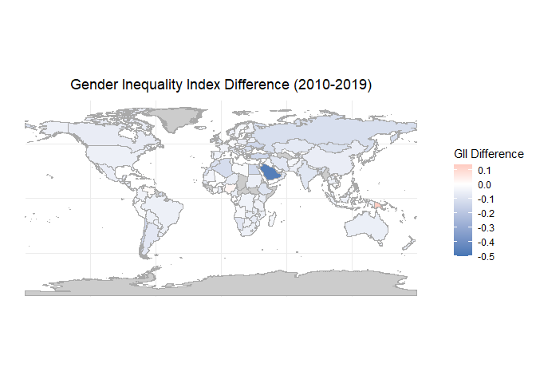

# Homework4

## Library

    library(readr)
    library(sf)
    library(here)
    library(tidyr)
    library(dplyr)
    library(countrycode)
    library(ggplot2)

## Read in data

    Composite_indices <- read.csv(here("homework4_data","HDR23-24_Composite_indices_complete_time_series.csv"))
    World_Countries <- st_read(here("homework4_data","World_Countries_(Generalized)_9029012925078512962.geojson" ))

    names(Composite_indices)
    names(World_Countries)

## Process and join data

Caculate difference in inequality between 2010 and 2019 
Transfer iso2c to iso3c by using countrycode package

    gender_inequality <- Composite_indices %>%
      select(iso3, contains("gii"))

    gender_inequality2 <- gender_inequality %>%
       mutate(gii_2019_2010 = gii_2019 - gii_2010)

    World_Countries2 <- World_Countries %>%
      mutate(ISO3 = countrycode(ISO,"iso2c","iso3c"))

    world_gender_inequality <- World_Countries2 %>%
      left_join(gender_inequality2, by = c("ISO3" = "iso3"))

## Plotting a map

To demonstrate the difference in the gender inequality index between
2010 and 2019

    ggplot(world_gender_inequality) + 
      geom_sf(aes(fill = gii_2019_2010), 
              color = "darkgray", 
              size = 0.1) + 
      scale_fill_gradient2(
        low = "#4575B4", 
        mid = "#FFFFFF", 
        high = "#D73027", 
        midpoint = 0, 
        na.value = "grey80", 
        name = "GII Difference") + 
      theme_minimal() + 
      labs(title = "Gender Inequality Index Difference (2010-2019)") + 
      theme(plot.title = element_text(hjust = 0.5))

